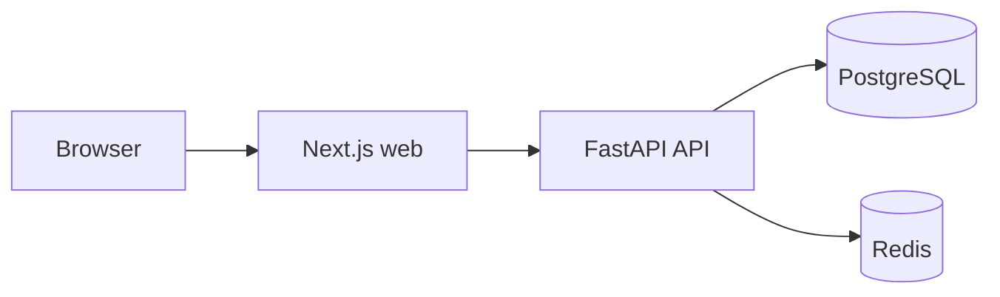

# Ahara

Ahara is a context-aware AI food companion. This repository currently contains the **prototype foundation**: a local web/API stack with health monitoring. AI functionality arrives in later commits.

## Architecture



Ollama and Qwen are intentionally not active components yet.

## Stack

- Next.js App Router, TypeScript, Tailwind CSS, ESLint
- Python 3.13, FastAPI, Pydantic Settings, SQLAlchemy 2
- PostgreSQL and Redis
- Docker and Docker Compose

## Prerequisites

- Docker Desktop with Docker Compose
- Node.js 24 LTS and npm 11+ (for frontend commands outside Docker)
- Python 3.13 (for backend commands outside Docker)

## Local setup

```powershell
Copy-Item .env.example .env
docker compose up --build
```

The copied `.env` contains safe local-development placeholders. Do not commit `.env`.

To stop services while retaining database data:

```powershell
docker compose down
```

## Services

| Service | URL / port |
| --- | --- |
| Web | http://localhost:3000 |
| API | http://localhost:8000 |
| API health | http://localhost:8000/api/v1/health |
| OpenAPI docs | http://localhost:8000/docs |
| PostgreSQL | localhost:5432 |
| Redis | localhost:6379 |

The API returns HTTP 200 when both dependencies are healthy. If PostgreSQL or Redis is unavailable, it reports a structured degraded response with HTTP 503.

## Tests and validation

Backend unit tests mock health dependencies and do not need running services:

```powershell
Set-Location apps/api
python -m venv .venv
.\.venv\Scripts\Activate.ps1
python -m pip install -e ".[dev]"
pytest
```

Frontend validation:

```powershell
Set-Location apps/web
npm install
npm run lint
npm run typecheck
npm run build
```

Validate Compose configuration:

```powershell
docker compose config
```

## Repository structure

```text
apps/
  api/       FastAPI application and tests
  web/       Next.js application
docs/        Architecture documentation
infra/       Infrastructure notes
scripts/     Future development scripts
.github/     GitHub workflow location
```

## Troubleshooting

- If a mapped port is already in use, stop the conflicting local process or adjust the Compose port mapping.
- If API health is degraded, inspect `docker compose logs api postgres redis` and wait for health checks to complete.
- If the web page shows `API Unavailable`, confirm `NEXT_PUBLIC_API_URL=http://localhost:8000` in `.env`, then rebuild the web container.
- To deliberately reset local Docker data, run `docker compose down -v`. This removes the local PostgreSQL and Redis volumes.

## Roadmap

1. Foundation and local development infrastructure (current)
2. Domain data model and application workflows
3. AI, Ollama/Qwen, and context-aware recommendation capabilities
