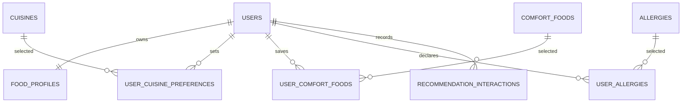

# Personalization data model

```mermaid
erDiagram
  USERS ||--|| FOOD_PROFILES : owns
  USERS ||--o{ USER_CUISINE_PREFERENCES : sets
  CUISINES ||--o{ USER_CUISINE_PREFERENCES : selected
  USERS ||--o{ USER_COMFORT_FOODS : saves
  COMFORT_FOODS ||--o{ USER_COMFORT_FOODS : selected
  USERS ||--o{ USER_ALLERGIES : declares
  ALLERGIES ||--o{ USER_ALLERGIES : selected
  USERS ||--o{ RECOMMENDATION_INTERACTIONS : records
```

This foundation stores preferences only. It does not search for restaurants, score recommendations, or make AI decisions.